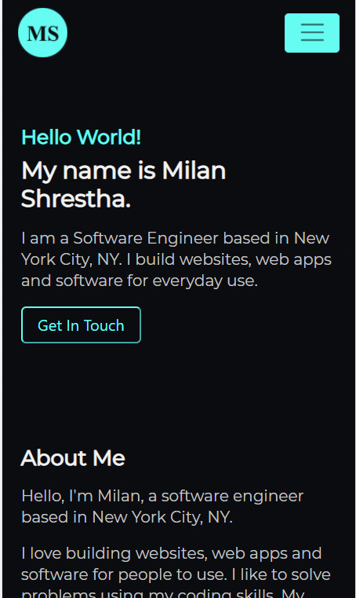

# My Portfolio 

## Overview
This is my first portfolio as a Software Engineer. I started learning programming about a year ago. I'd an opportunity to attend programming course provided by LaunchCode from St. Louis where I got foundational knowledge in JavaScript & Java and also learned to use some frameworks and tools like Angular, Spring Boot, Thymeleaf, MySQL, Hibernate etc.

I picked Angular as a frontend framework for my portfolio app. I wanted to learn more about Angular while building my project.

## Technologies Used
- Angular
- TypeScript
- Bootstrap
- HTML/CSS

## Live Portfolio 

My portfolio can be viewed at [***milanshrestha.dev***](https://milanshrestha.dev)

It is being hosted via Github Pages.

## Snapshot of my portfolio

### Desktop View

### Mobile View

